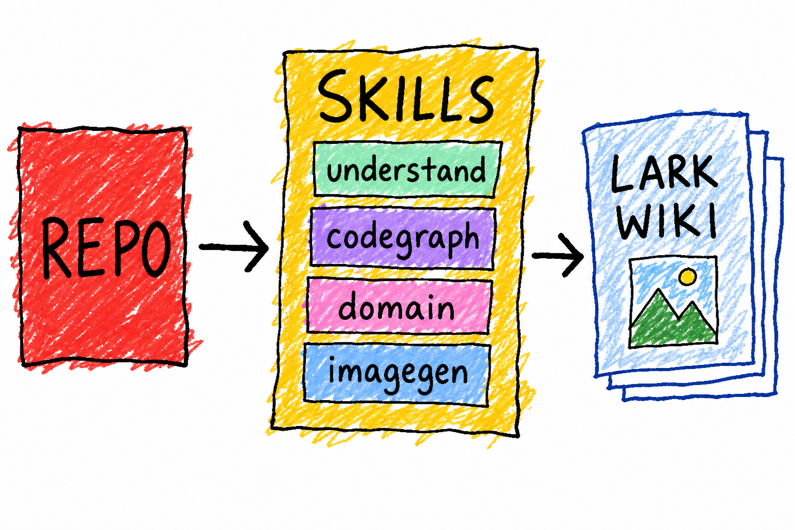

# repo-to-wiki

> 版本以 [`skills/repo-to-wiki/VERSION`](skills/repo-to-wiki/VERSION) 为准（当前 **1.1.0**）。skill 每次使用前会自检远端最新版，落后会提示更新。



一个 agent skill：把一个陌生代码仓库，一条链路跑完，变成一棵**中文多子页飞书 wiki 文档树**（业务理解 + 源码理解 + 手绘插图）。

它**编排**团队已有的 skill，不重复造轮子：
`understand-anything` · `codegraph` · `code-search` · `chatgpt-imagegen` · `lark-doc` · `lark-wiki` · `portwind-wiki`。

## 安装

```sh
npx skills add pw-OpenCapsule/repo-to-wiki --skill repo-to-wiki -g
```

装好后，在 agent 里说「用 repo-to-wiki 把这个项目沉淀进 wiki」即可。

**更新到最新**：再跑一次上面的 `npx skills add`（安装的是快照、不会自动更新；skill 自检发现落后时也会提示你跑这条）。

## 版本

- 版本号见 `skills/repo-to-wiki/VERSION`，变更记录见 [CHANGELOG.md](CHANGELOG.md)，发版打 git tag `vX.Y.Z`。
- **维护纪律**：任何改动必须同步 bump `VERSION` + 加 CHANGELOG 一条 + 打 tag，否则自检对不上。

## 它做什么

| 步 | 用什么 | 产出 |
|---|---|---|
| 1 拿地图 | understand-anything `/understand --language zh` | 分层 + 导览 + 知识图谱 |
| 2 读主链路（仓内） | codegraph | 谁调谁、X 怎么流到 Y |
| 3 理解上下游（跨仓） | code-search | 接口在哪个仓、谁在调、前后端怎么对 |
| 4 补业务 | domain-analyzer (understand-domain) | 业务域 + 业务流 |
| 5 配图 | chatgpt-imagegen（固定提示词） | 手绘示意图（丑风格、内容正确） |
| 6 沉淀 | lark-doc / lark-wiki + portwind-wiki | 飞书 wiki 多子页 |

## 两种用法

- **Skill 模式**：自然语言「用 repo-to-wiki 把这个仓库沉淀进 wiki」，agent 跟着 SKILL.md 跑。
- **Workflow 模式**：用 Claude Code 的 `Workflow` 工具跑 [`skills/repo-to-wiki/repo-to-wiki.workflow.js`](skills/repo-to-wiki/repo-to-wiki.workflow.js)——确定性编排，子页「写内容→出图」并行 pipeline，最后顺序发布。需传 `args: { repoPath, spaceId, parentNodeToken }`。

## 前置依赖

- 上述 skill 已安装
- `lark-cli` 已登录，具备 `wiki:node:create` / `docx:document:write_only` / `docs:document.media:upload` 等 scope
- `chatgpt-imagegen` 的 web 或 codex backend 可用

## 插图风格（固定）

「最大的色块、涂鸦感、白底、老式画图程序鼠标手绘、低清惨兮兮」——**但内容必须对**（正确的框/箭头/短英文标签）。完整提示词见 [`skills/repo-to-wiki/references/image-prompt.md`](skills/repo-to-wiki/references/image-prompt.md)。

## 文档

完整流程、命令配方、页面规划见 [`skills/repo-to-wiki/SKILL.md`](skills/repo-to-wiki/SKILL.md)。

## License

MIT
